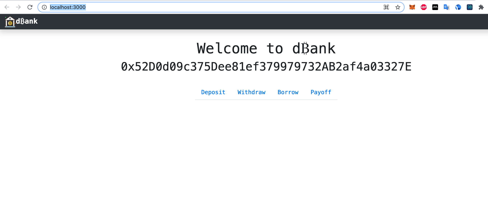

This is the tutorial from [DApp Univeristy](https://www.dappuniversity.com/) which is configured to work on harmony blockchain.

Steps
* `npm install`
* `truffle compile`
* `truffle migrate --reset --network testnet`
* `npm start` which should popup http://localhost:3000/ page
* make sure to connect metamask to harmony testnet, as the dbank contracts are deployed on harmony testnet 

